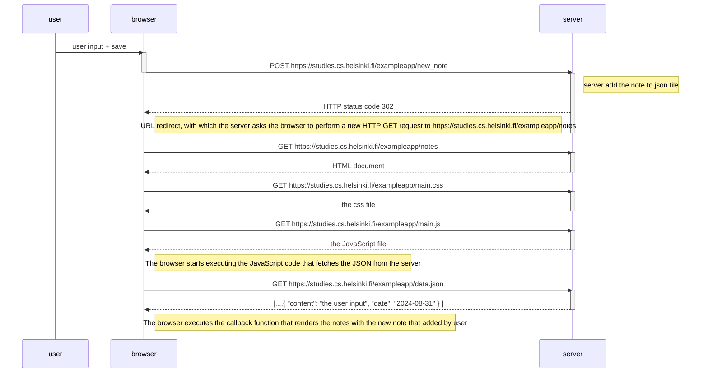

```mermaid

sequenceDiagram
    participant user
    participant browser
    participant server

    user->>browser:user input + save
    activate browser
    browser->>server: POST https://studies.cs.helsinki.fi/exampleapp/new_note
    deactivate browser

    activate server
    note right of server: server add the note to json file
    server-->>browser: HTTP status code 302
    note right of browser:URL redirect, with which the server asks the browser to perform a new HTTP GET request to https://studies.cs.helsinki.fi/exampleapp/notes
    deactivate server

    browser->>server: GET https://studies.cs.helsinki.fi/exampleapp/notes
    activate server
    server-->>browser: HTML document
    deactivate server

    browser->>server: GET https://studies.cs.helsinki.fi/exampleapp/main.css
    activate server
    server-->>browser: the css file
    deactivate server

    browser->>server: GET https://studies.cs.helsinki.fi/exampleapp/main.js
    activate server
    server-->>browser: the JavaScript file
    deactivate server

    Note right of browser: The browser starts executing the JavaScript code that fetches the JSON from the server

    browser->>server: GET https://studies.cs.helsinki.fi/exampleapp/data.json
    activate server
    server-->>browser: [...,{ "content": "the user input", "date": "2024-08-31" } ]
    deactivate server

    Note right of browser: The browser executes the callback function that renders the notes with the new note that added by user


```
