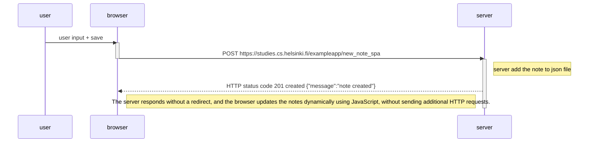

```mermaid

sequenceDiagram
    participant user
    participant browser
    participant server

    user->>browser:user input + save
    activate browser
    browser->>server: POST https://studies.cs.helsinki.fi/exampleapp/new_note_spa
    deactivate browser

        activate server
    note right of server: server add the note to json file
    server-->>browser:HTTP status code 201 created  {"message":"note created"}
    note right of browser: The server responds without a redirect, and the browser updates the notes dynamically using JavaScript, without sending additional HTTP requests.
    deactivate server


```
